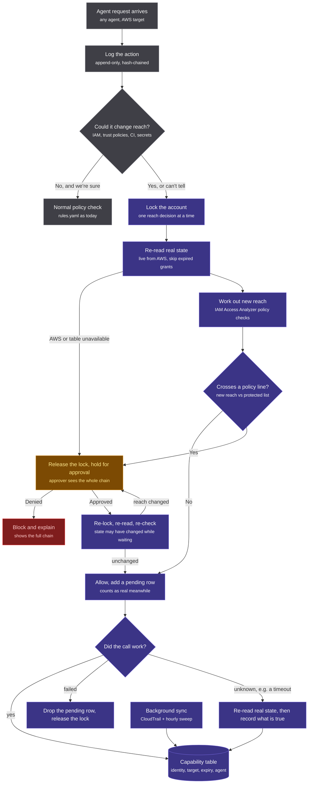

# Design: reach checks for AWS

**Status:** proposed, not built yet. Comments welcome on [#18](https://github.com/batrapulkit/squidbrake/issues/18).

## The problem

Squidbrake checks each action on its own. Some of the worst outcomes are built from steps that each look fine:

1. the agent creates an IAM role (normal),
2. lets that role be assumed by its own identity (looks like housekeeping),
3. attaches a policy that can assume an admin role (one more line of JSON),
4. and now the agent can do anything in the account.

No single step is "dangerous", but the agent's **reach** (what it can touch) quietly became the whole account. Reach checks look at
the effect of a change on what the agent can reach, not just at the change itself.

## Flow

## Decisions, and why

| Decision | Why |
|---|---|
| **"Can't tell" counts as "could change reach"** | An agent can change IAM through `python deploy.py` or `terraform apply` as easily as through `aws iam ...`. If we can't classify a call, the unsafe default would be a bypass. |
| **Lock per account, released while waiting for a person** | The lock stops two calls that are each fine from combining into an escalation. Holding it during a 5-minute approval would freeze the whole account. |
| **Re-read and re-check after approval** | Approval takes time; the account may have changed. An approval covers the reach that was shown, not whatever exists by then. |
| **Pending rows count as real** | Until a change is confirmed or ruled out, assume it happened, so nothing slips through between the call and the sync. |
| **Unknown outcome: re-read, don't guess** | If a call times out we don't know whether it ran. Dropping the row would under-count reach; re-reading AWS tells us. |
| **AWS down: hold, never allow** | Same fail-closed rule as the rest of Squidbrake. |
| **Use IAM Access Analyzer's policy checks, not our own IAM engine** | IAM evaluation (trust policies, permission boundaries, SCPs, resource policies, conditions) is easy to get subtly wrong, and a wrong "safe" is worse than no check. AWS already offers checks for "does this grant new access" and "does this grant access to X". |

## First version (MVP)

- **Scope:** IAM changes only: creating roles and users, attaching or putting policies, `iam:PassRole`, changing trust policies.
- **Sources:** the AWS CLI and boto3 calls, and `terraform plan` output (check the plan before `apply`).
- **Check:** "does the new policy reach anything on the protected list" (admin roles, production accounts, secrets) via IAM Access Analyzer.
- **Packaging:** an optional extra, `pip install squidbrake[aws]`. The core stays dependency-free and never needs cloud credentials.
- **Later:** the capability table, CloudTrail sync, role-hop graphs across accounts, GCP and Azure.

## Open questions

- Which read-only AWS permissions does the gateway need, and how do we keep them away from the agent?
- How should the protected list be written in `rules.yaml`?
- Is `terraform plan` the right place to check, rather than each API call?

If your agents have AWS access, we'd love to hear how you handle this today: open an issue or comment on [#18](https://github.com/batrapulkit/squidbrake/issues/18).
